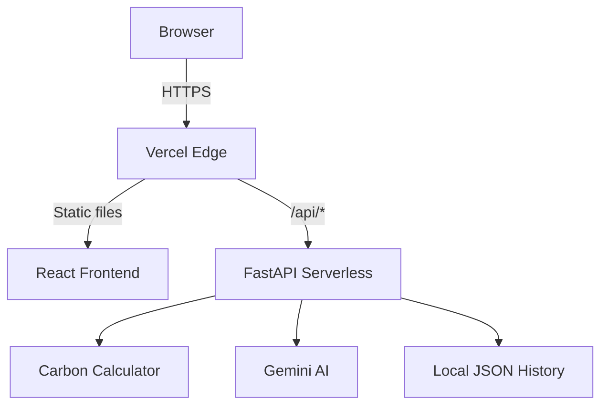

# 🌱 EcoPulse — Carbon Footprint Tracker

[](https://github.com/SATYANARAYANA21/EcoPulse-CarbonFootprint/actions/workflows/ci.yml)
[](https://opensource.org/licenses/MIT)
[](https://ecopulse-carbonfootprint.vercel.app)
[](https://www.python.org/)
[](https://react.dev/)

> AI-powered personal carbon footprint calculator with **Gemini AI insights**, history tracking, and beautiful data visualizations.

🔗 **Live Demo**: [https://ecopulse-carbonfootprint.vercel.app](https://ecopulse-carbonfootprint.vercel.app)

---

## ✨ Features

- 🧮 **Smart Carbon Calculator** — Calculates footprint across transport, home energy, diet & shopping
- 🤖 **Gemini AI Insights** — Personalized, actionable tips powered by Google Gemini
- 📊 **Beautiful Charts** — Visual breakdowns with Recharts
- 💾 **History Tracking** — Save and compare past calculations
- 📱 **Fully Responsive** — Works on all screen sizes
- ♿ **Accessible** — WCAG 2.1 AA compliant
- 🔒 **Secure** — Rate limiting, input validation, OWASP security headers

---

## 🏗️ Architecture

```
EcoPulse-CarbonFootprint/
├── frontend/          # React + Vite + TypeScript SPA
│   ├── src/
│   │   ├── components/    # UI Components
│   │   ├── store/         # Zustand state management
│   │   └── api/           # API client
│   └── package.json
├── backend/           # FastAPI Python backend
│   ├── app/
│   │   ├── routes/        # API endpoints
│   │   ├── services/      # Gemini AI, Firestore, etc.
│   │   ├── models/        # Pydantic models
│   │   └── core/          # Config, rate limiting, security
│   └── requirements.txt
├── api/
│   └── index.py       # Vercel serverless entry point
└── vercel.json        # Vercel deployment config
```



---

## 🚀 Quick Start

### Prerequisites
- Node.js 18+
- Python 3.11+

### Run Locally

```bash
# Clone the repo
git clone https://github.com/SATYANARAYANA21/EcoPulse-CarbonFootprint.git
cd EcoPulse-CarbonFootprint

# Install & start both frontend + backend together
cd frontend
npm install
npm run dev
```

> The `npm run dev` command starts both the React frontend (port 5173) and FastAPI backend (port 8000) concurrently.

### Backend only
```bash
cd backend
python -m venv .venv
.venv/Scripts/activate    # Windows
pip install -r requirements.txt
uvicorn app.main:app --reload --port 8000
```

---

## 🌐 Deployment (Vercel)

The app is deployed on Vercel as a monorepo with:
- **Frontend**: Built from `frontend/` using Vite
- **Backend**: Python serverless function at `api/index.py`

```bash
# Deploy to production
npx vercel --prod
```

### Environment Variables (Vercel Dashboard)

| Variable | Description | Default |
|----------|-------------|---------|
| `GEMINI_API_KEY` | Google Gemini API key for AI insights | — |
| `USE_GEMINI` | Enable AI insights | `false` |
| `USE_FIRESTORE` | Enable cloud history storage | `false` |

Get a free Gemini API key at [aistudio.google.com](https://aistudio.google.com)

---

## 🔌 API Endpoints

| Method | Endpoint | Description |
|--------|----------|-------------|
| `GET` | `/api/health` | Health check |
| `POST` | `/api/calculate` | Calculate carbon footprint |
| `POST` | `/api/insights` | Get Gemini AI insights |
| `POST` | `/api/entries` | Save a history entry |
| `GET` | `/api/entries/{device_id}` | Get history for a device |

---

## 🛠️ Tech Stack

| Layer | Technology |
|-------|-----------|
| Frontend | React 18, TypeScript, Vite, Zustand, Recharts |
| Backend | FastAPI, Pydantic, Slowapi |
| AI | Google Gemini API |
| Deployment | Vercel (Serverless) |
| Validation | Zod (frontend), Pydantic (backend) |

---

## 📄 License

MIT © [SATYANARAYANA21](https://github.com/SATYANARAYANA21)
